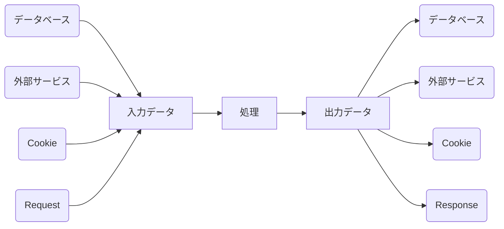

# Testable とはなんぞや

こないだ、業務でちょっと他チームのヘルプを行いまして、新規のコードを読みました。

よくある、1メソッドが数百行というコードが待ち構えていました。当然そのままでは読みにくい。

こういうとき、私はよく理解のために部分部分のコードを小さなメソッドに切り出すリファクタリングを行います。

ここのひとかたまりの処理は、Aというデータを入力してBというデータを作成する部分だな、という雰囲気です。

## リーダーに中間報告した際

「ちょっとリファクタリングはナシでお願いします」と言われました。

確かに、リファクタリング結果を確認するためのユニットテストも存在しない状態ですし、あくまで理解のため、というのもありましたので、いじったコードは元に戻しました。

> あくまで自分は一時的なヘルプの立場ですしね。

## なぜリファクタリングをやめて、となるのか

リファクタリングの原則として、変更前後のコードの動作は同じでなければなりません。動作が変わってしまうということはデグレにつながりますし、どこでどんな影響が出るかわかりません。
動作が同じであることを確認するには、やはりユニットテストの存在が必須です。

一方で、数百行にわたるメソッドのユニットテストを書くのはかなり困難を伴います。
そりゃあユニットテストが存在しないわけです。

## あらためて、Testableとは

ようやく本題です。じゃあどうなればテストを書きやすくなるのか。

いったんサーバサイドのAPI処理に話を限定しますが、テストしにくいコードには、おおよそ副作用が存在します。たとえば以下のようなものを指します。

* Webからfetchしてくる
* DBからデータを読み込む
* Cookieを読み込む
* Responseを返す

おおまかにAPIの役割は、以下のように要約できます。

上記のうち、入力データを受けてなにかしらこねくり回した結果を出力データとして返す部分こそテストを行いたい箇所になります。

> データベースからちゃんと値が取れているか、はまた別の機会に確認したいですよね。

このとき、入力データ、出力データはおおむね以下の集まりです。

* 文字列
* 数値 (整数なり浮動小数点なり)
* Boolean (数値の一部に入れてもいいかも)

この文字列と数字の集合は容易に作成可能ですし、どのような結果になるかも一意に決まります。このように入力と出力が一意に決まる、予測可能な関数のことを関数型プログラミング言語では純粋関数と呼びます。

入力データ、出力データが用意される境界を見つけ、切り出すことができれば、そこに対するユニットテストを書ける、ということになります。

コードをTestableにするには、上記の境界を明確にすればよい、というわけです。

# まとめ

データの境界を見つけ、関数を純粋に保って、ユニットテストを書きましょう！
